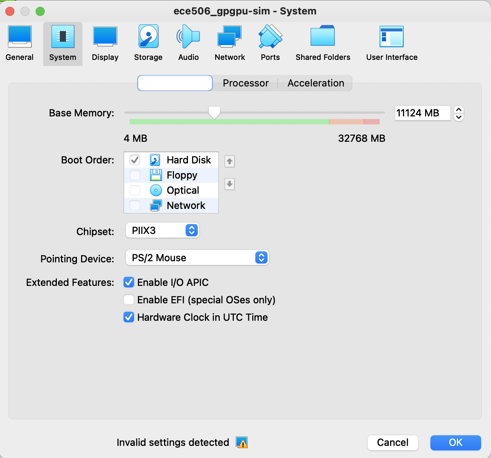
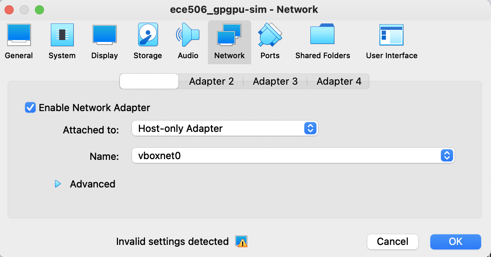
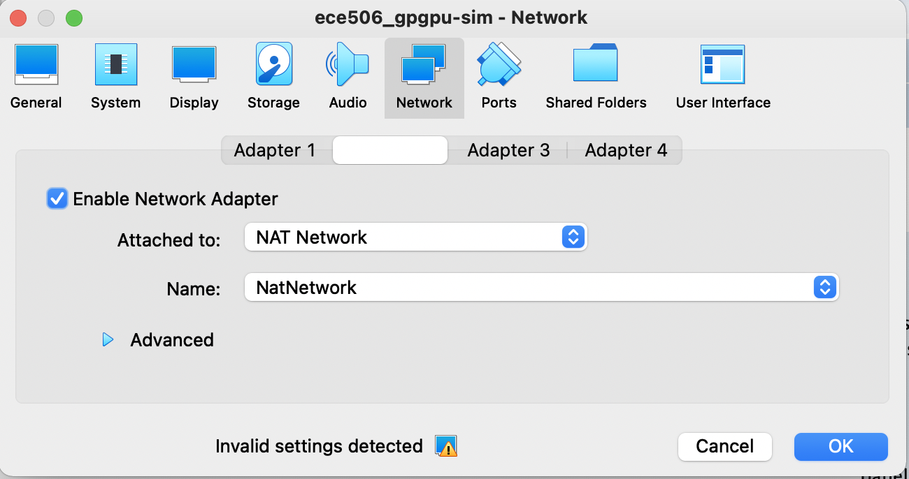
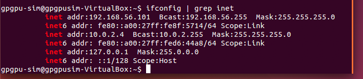
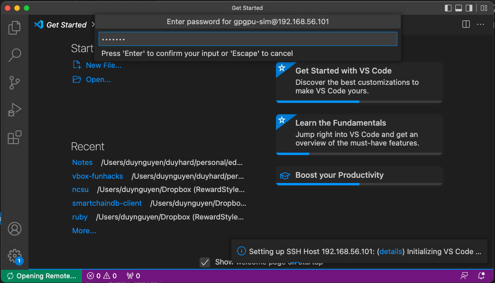
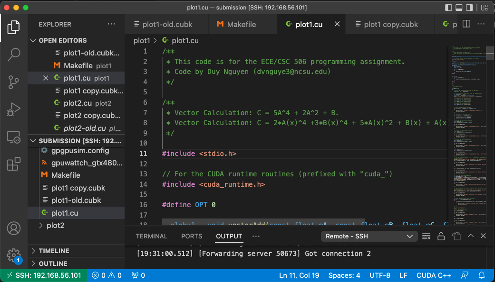

# Visual Studio Code with Virtual Box for local development

This document is to provide quick steps to setup and connect Visual Studio Code IDE running on Host machine to a "remote" development environment running on Virtual Box

## Prerequisites (Lab environments/setups)

Some highlights about the environment I used for my setup:

- Host: MacOS
- Virtual Box 6.1
- Visual Studio for Mac version 1.67.0
- Base image Ubuntu 16.04 64 bit (No ssh server enabled)

## Import the Ubuntu base image to Virutal box

This step is straight forward, just select File in the menu >> Import Appliance (or Cmd + I)

Once done, select Machine menu >> Settings >> System icon (tab) >> Motherboard and adjust the Base memory value accordingly, I adjusted mine to be ~ 11 GB



Now simply start the VM by hitting Start button.

## Setup networks for the VM to be accessible from 

For the VM to be accessible from your Host machine (eg: via SSH), you need to have a network interface with Host-only Adapter option:



For the VM to access the interview (via your Host computer), you need to have a network interface with NAT network enabled:



## Install SSH server on your Guest VM

If your image does not come with SSH service (like in my case), you need to install and set it up for your Host to communicate with the VM via SSH.

Note that you need to complete the "Setup networks for the VM to be accessible from" step above to be able to install the ssh service from internet.

```code
$ sudo apt install openssh-server
$ sudo /etc/init.d/ssh start
```

Find out the IP address of your VM (Note: you can assign a static IP to your VM, but for simplicity, just grasp the one assigned to it with DHCP for now)



in my case, it's `192.168.56.101` 

Now you can SSH to your Guest VM that also opens door for using cool things by Visual Studio Code utilizing it's Remote-SSH Extensions

## Connect Visual Studio Code to your Guest VM

Now you can use your Visual Studio Code to write code to your Guest VM via it's Remote-SSH extension, find it [here](https://code.visualstudio.com/docs/remote/ssh)

From VSC >> View >> Command Palette ..





Happy coding!


